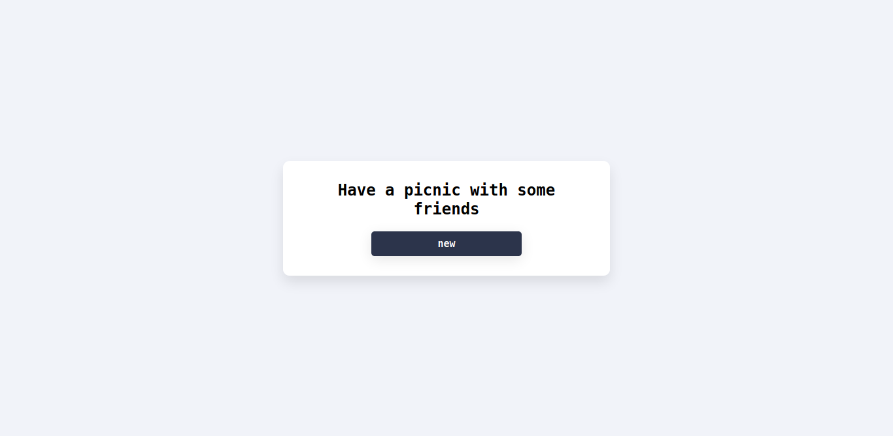

# day-18-in-30-days-of-react 

- in this project I make something simple, a personalized hook, but it was good to learn more about how hooks work and some specific cases of complications to call some hooks

# result image  

